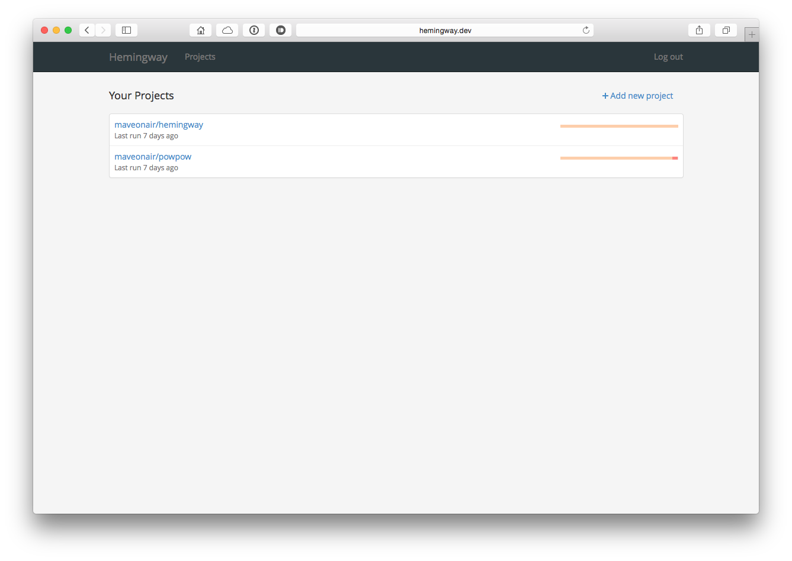
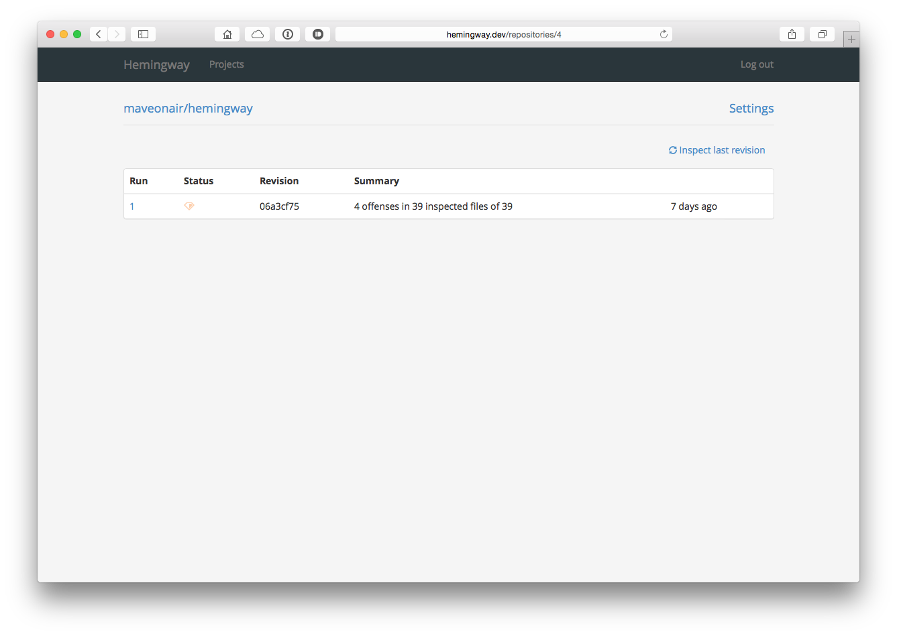
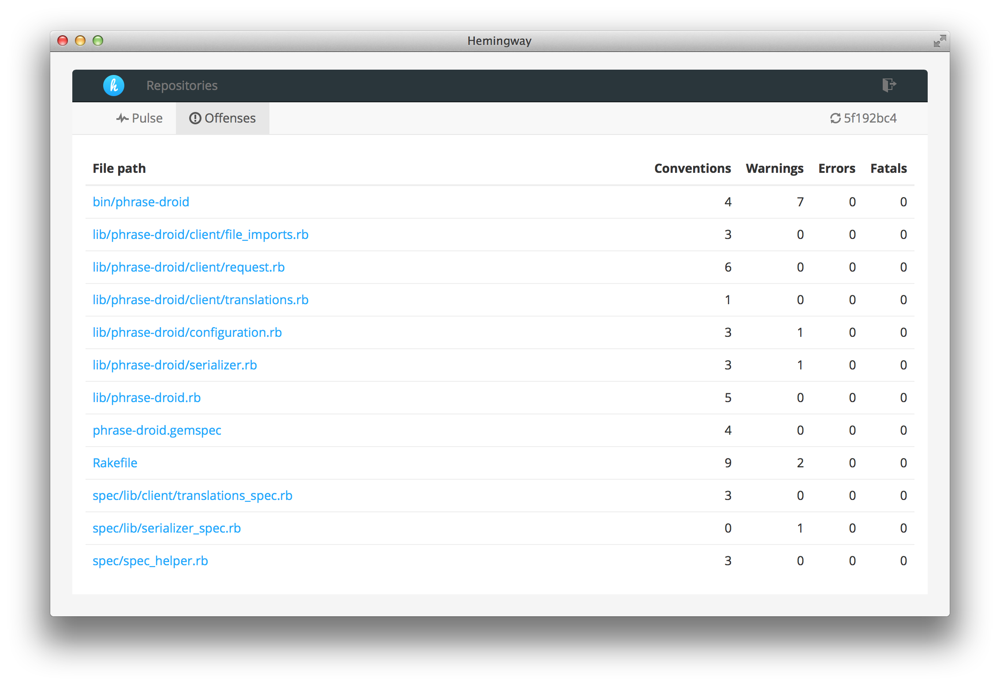
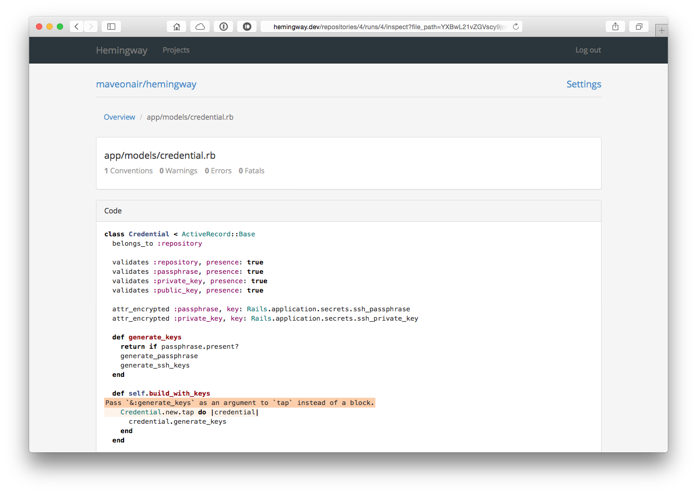

# Hemingway

Hemingway is a web application to inspect the results of the static ruby code analyzer [Rubocop](https://github.com/bbatsov/rubocop).










## Dependencies
```sh
$ brew install redis-server
$ brew install libssh2
```

## Configuration
Add the required secrets to your config/secrets.yml:

```
production:
  secret_key_base: <%= ENV["SECRET_KEY_BASE"] %>
  github_key: YOUR_GITHUB_KEY
  github_secret: YOUR_GITHUB_SECRET
  ssh_passphrase: YOUR_SSH_PASSPHRASE
  ssh_private_key: YOUR_SSH_PRIVATE_KEY_PASSWORD
```

|  Secret  | Description |
|---|---|
| github_key |  Your GitHub Application Client ID |
| github_secret |  Your GitHub Applicaiton Client Secret |
| ssh_passphrase | This secret is required to encrypt the passphrase of a generated SSH key pair to access a GitHub repository |
| ssh_private_key | This secret is required to encrypt the private key of a generated SSH key pair to access a GitHub repository|


## Installation
```sh
$ bundle install --path=.bundle
```

## Start
Start Sidekiq (Hint: redis-server must be running):

```sh
$ bundle exec sidekiq
```

Start Rails Server:

```sh
$ bundle exec rails server
```

## TODOs
This is a prototype application and thus a lot is to do...

* Team Management (a user belongs to one or more teams)
* Adding Open Source projects
* Web Hook to receive push notifications from GitHub
* Testing

## Acknowledgments
Many thanks to the [Rubocop Team](http://https://github.com/bbatsov/rubocop) for their great work!

Licence

The MIT Licence

Copyright (c) Fabian Mettler

Permission is hereby granted, free of charge, to any person obtaining a copy of this software and associated documentation files (the "Software"), to deal in the Software without restriction, including without limitation the rights to use, copy, modify, merge, publish, distribute, sublicense, and/or sell copies of the Software, and to permit persons to whom the Software is furnished to do so, subject to the following conditions:

The above copyright notice and this permission notice shall be included in all copies or substantial portions of the Software.

THE SOFTWARE IS PROVIDED "AS IS", WITHOUT WARRANTY OF ANY KIND, EXPRESS OR IMPLIED, INCLUDING BUT NOT LIMITED TO THE WARRANTIES OF MERCHANTABILITY, FITNESS FOR A PARTICULAR PURPOSE AND NONINFRINGEMENT. IN NO EVENT SHALL THE AUTHORS OR COPYRIGHT HOLDERS BE LIABLE FOR ANY CLAIM, DAMAGES OR OTHER LIABILITY, WHETHER IN AN ACTION OF CONTRACT, TORT OR OTHERWISE, ARISING FROM, OUT OF OR IN CONNECTION WITH THE SOFTWARE OR THE USE OR OTHER DEALINGS IN THE SOFTWARE.
