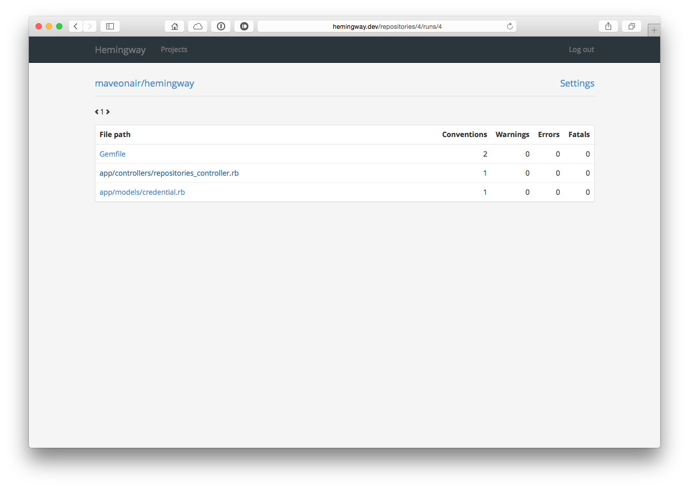

# Hemingway

Hemingway is a web application to visualize the results of the static ruby code analyzer [Rubocop](https://github.com/bbatsov/rubocop).





## Dependencies
```sh
$ brew install redis-server
$ brew install libssh2
```

## Configuration
Add the required secrets to your config/secrets.yml:

```
production:
  secret_key_base: <%= ENV["SECRET_KEY_BASE"] %>
  github_key: YOUR_GITHUB_KEY
  github_secret: YOUR_GITHUB_SECRET
  ssh_passphrase: YOUR_SSH_PASSPHRASE
  ssh_private_key: YOUR_SSH_PRIVATE_KEY_PASSWORD
```

|  Secret  | Description |
|---|---|
| github_key |  Your GitHub Application Client ID |
| github_secret |  Your GitHub Applicaiton Client Secret |
| ssh_passphrase | This secret is required to encrypt the passphrase of a generated SSH key pair to access a GitHub repository |
| ssh_private_key | This secret is required to encrypt the private key of a generated SSH key pair to access a GitHub repository|


## Installation
```sh
$ bundle install --path=.bundle
```

## Start
Start Sidekiq (Hint: redis-server must be running):

```sh
$ bundle exec sidekiq
```

Start Rails Server:

```sh
$ bundle exec rails server
```

## TODOs

Basically, this is a prototype application

* Team Management (a user belongs to one or more teams)
* Adding Open Source projects
* Web Hook to receive push notifications from GitHub
* Testing

## Acknowledgments
Many thanks to the [Rubocop Team](http://https://github.com/bbatsov/rubocop) for their great work!
